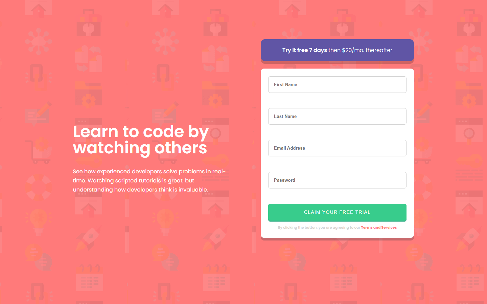

# Frontend Mentor - Intro component with sign up form solution

This is a solution to the [Intro component with sign up form challenge on Frontend Mentor](https://www.frontendmentor.io/challenges/intro-component-with-signup-form-5cf91bd49edda32581d28fd1). Frontend Mentor challenges help you improve your coding skills by building realistic projects.

## Table of contents

-   [Overview](#overview)
    -   [The challenge](#the-challenge)
    -   [Screenshot](#screenshot)
    -   [Links](#links)
-   [My process](#my-process)
    -   [Built with](#built-with)
    -   [What I learned](#what-i-learned)
    -   [Continued development](#continued-development)
    -   [Useful resources](#useful-resources)
-   [Author](#author)

## Overview

    A Signup/register form can be challenging when people wants to be interactive. That's what this challenge was, at the beginning.

### The challenge

Users should be able to:

-   From the previous challenge i was able to put error icons on the right position with _absolute_, but with multiple icons on a different inputs I found it's much more quicker and looks better with using background on the input itself.
-   Making email placeholder to switch the text and the color wasn't easy to, but with help from Chat GPT I managed to do it.
-   Refactoring the logic (in _javaScript.js_) behind the verification was a hard task too.

### Screenshot

### Links

-   Solution URL: [Frontend Mentor](https://your-solution-url.com)
-   Live Site URL: [Vercel](https://your-live-site-url.com)

## My process

### Built with

-   Semantic HTML5 markup
-   Vanilla CSS
-   Flexbox
-   Mobile-first workflow

### What I learned

-   Have better gaps how to abstract JS logic;
-   Faster and easier way to build some elements of the form;
-   More CSS properties and how to use them;

### Continued development

I'll continue developing my skills with HTML , CSS and vanilla JS, because i think Fundamentals are really important.

### Useful resources

-   [CSS-Tricks](https://css-tricks.com/) - This website has everting about CSS and can help in every way.
-   [Chat-GPT](https://chatgpt.com/) - Love using it to find faster attributes or properties in HTML and CSS, also helps to find my mistakes easier (sometimes).

## Author

-   GitHub - [Nikolay Toshev](https://github.com/gilotin)
-   Frontend Mentor - [@gilotin](https://www.frontendmentor.io/profile/gilotin)
-   LinkedIn - [@yourusername](https://www.linkedin.com/in/nikolay-toshev-5536a025b/)
